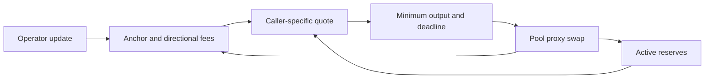

# Trading Overview

LunarBase is a proactive market maker whose operators publish an anchor price and two directional fees. The Pool converts exact-input amounts at the squared anchor, then deducts a fee that includes the current trade's reserve-relative punishment. Successful swaps change stored fees and active reserves; the anchor stays fixed until an operator update.

## Deployments

The integration covers Base native ETH/USDC (`8453`) and BNB Smart Chain native BNB/USDT (`56`). Use the proxy and token addresses in the [registry](../mainnet/addresses.json), with the [trading ABI](../abi/Pool.trading.abi.json).

Native currency is represented by `X() == address(0)`. On Base, Y is USDC with 6 decimals; on BNB Chain, Y is USDT with 18. Token order and decimals determine the raw-unit price, the chosen directional fee, and the units of output and fees.

## Price and state

| Value | Meaning |
| --- | --- |
| `state().anchorPrice` | `uint160` Q64.96 square-root price in raw Y/X units |
| `state().feeBidX24` | Stored X -> Y fee including accumulated punishment |
| `state().feeAskX24` | Stored Y -> X fee including accumulated punishment |
| `state().latestUpdateBlock` | Block of the latest operator pricing update |
| `getXReserve()`, `getYReserve()` | Cached active reserves used by the quote model |
| `maxPunishmentX24()` | Maximum per-trade punishment factor |
| `blockDelay()` | Strict freshness window in blocks |
| `isWhitelisted(caller)`, `blacklistFeeMultiplier()` | Fee multiplier for the immediate execution caller |

Active reserves differ from raw contract balances because some balances belong to escrow or fee buckets. Read the reserve getters for quotes. Use one block for the entire snapshot; combining values from different blocks can produce a state that never existed.

## Quote to settlement

`quoteXToY`, `quoteYToX` and `quoteExactIn` are read-only alternatives. They include immediate punishment but do not commit it. The first two also return the output-token fee and unchanged anchor. See [price discovery](price-discovery.md) for rounding and zero-output cases.

Native input uses `swapExactInNative` with `msg.value`. ERC-20 input uses a `swapExactIn` overload with direct Pool allowance or Permit2. USDC -> ETH on Base is an ERC-20-input swap with native output. The Pool pulls input before sending output; there is no deferred-payment swap callback. See [settlement](settlement.md).

## What makes a quote executable

Swaps require unpaused, fresh state and a nonzero output. Freshness is strict: a block equal to `latestUpdateBlock + blockDelay` is already stale. A swap also checks deadline, minimum output, token transfers and numeric/accounting limits. Public quote views do not enforce pause state or every execution condition.

Whitelist and partner attribution use the address calling the Pool. If an aggregator calls it, quote for the aggregator address. Changing the output recipient does not change that fee policy.

After a successful swap, refresh both directional projections: the traded fee changes and the new reserves affect punishment in both directions. After an operator update, use the newly published anchor and directional fees. Reverted transactions commit neither reserve nor fee changes. [Off-chain integration](offchain-integration.md) explains coherent caches and sequential simulations.
